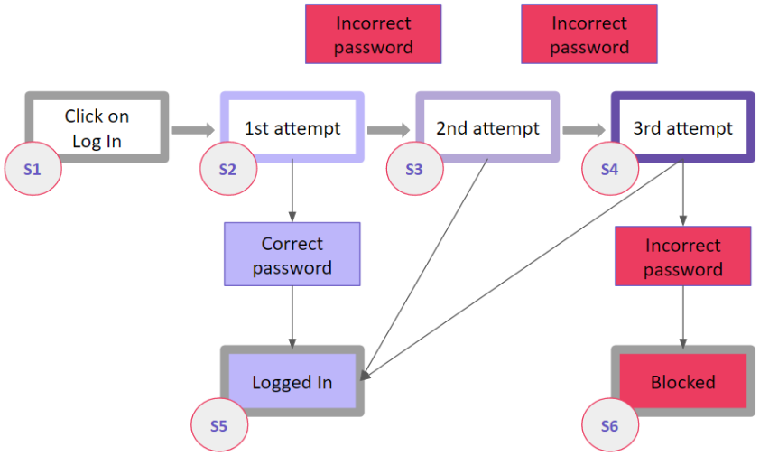
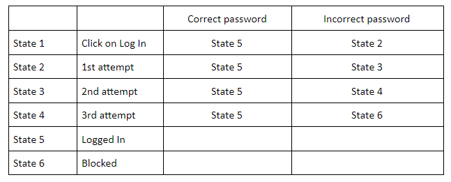
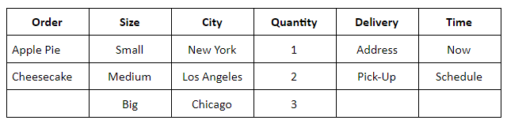
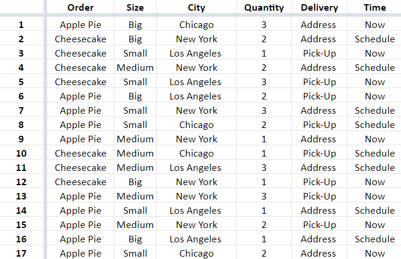

[Source](https://www.qamadness.com/5-test-design-techniques-qa-engineers-should-know/)

# What is test design?

Test design is a stage of the quality assurance process, during which we create test scenarios and outline the structure of testing activities for the project. A QA team decides on how to escalate test coverage with minimum effores

The main purpose of the test design process is to structure QA routines so it becomes easier to keep track of the requirements coverage. Test design is needed:

- to develop tests that help to detect serious errors;
- to take a thoughtful approach to testing and avoid wasting resources;
- to minimize the number of tests required to validate the product.

## Test design techniques

There are dozen of test design techniques you can use, but let focus on the most popular ones:

- Equivalent Class Partitioning
- Boundary Values Analysis
- State Transition
- Pairwise Testing
- Error Guessing

 

### \#1. Equivalent Class Partitioning (ECP)

The ECP implies splitting test data into classes, where all elements are similar in some way. This technique make sence only if the componets are similar and can fit in a common group. 
Choosing this technique meas that we are going to test only a few values from every group. ECP doesn't guarantee that the rest of the values not covered by the tests will be bug-free. We only assume that using several elements from the group will be quite illustrative. 
The ECP is good solution for case when you deal with a large volume of incoming data or numerous identical input variants. Otherwise, it might make sense to cover a product with tests more closely.

*Example:*
Let's say, there is a online store that offers different shipping rates depending on a cart price.
1. The shipping price for orders below \$100 is \$15.
2. The sipping price for order over \$100 is \$5.
3. Free shipping on order over \$300.

If you use the ECP technique, you get three sets of data to test:

1. From \$1 to $100:
    - valid boundary conditions: any price in the range from 1 to 99.99;
    - invalid boundary conditions: any price below 1 or above 99.99.

2. From \$100 to $300:
    - valid boundary conditions: any price in range from 100 to 299.99;
    - invalid: any price below 100 or above 299.99.

3. \$300 and higher:
    - valid: any price above 299.99;
    - invalid: any price below 300.

So, we can just pick a several numbers from each price range and assume that the rest of alike inputs will show the same results.

### \#2. Boundary Value Analysis (BVA)
BVA is similar to the previous technique. We still group data in equivalent classes but don't test values from a particular class only. Instead, we check boundary values, those that are at the 'borders' of the classes.

*Example:*
Let's take the previous scenario with varying shipping rates. Assuming that errors are the most likely to occour at the boundaries, we test only the 'boundary' numbers:

1. From \$1 to $100:
    - valid: 1.00, 1.01, 99.99;
    - invalid: 0.99, 100.00, 100.01.

2. From \$100 to $300:
    - valid: 100.00, 100.01, 299.99;
    - invalid: 99.99, 300.00.

3. \$300 and higher:
    - valid: 300, 300.01;
    - invalid: 299.99.

### \#3. State Transition
The state transition visualizes the states of SW at a different time frames and stages of usage. This technique is effective for creating test suites for systems that have many state variations. It will be helpful if you test a sequence of events with a finite number of input options.

*Example:*
The simplest example of the state transition is visualizing logging into an account during web or mobile app testing. Let's say, we are testing a system that offers a limited number of attempts to enter a correct password. If a user fails to enter a correct password, the system blocks the access. 
Blocks of different colors designate specific states of the system.

A chart like this makes it easier to match possible inputs with expected outputs. Having a visualization right in front of your eyes helps to keep a clear head and connect the states correctly. You can later arrange the data concisely and convenietly - for example, in a table to look up to during testing:

### \#4. Pairwise Testing
The pairwise testing is based on mathematical algorithms, namely combinatorics. It makes it possible to create unique pairs and test a huge amount of incoming data in different combinations, but the calculations might get complicated. To cover the maximum of features with test scripts that will require minimum time for testing you need to match data correctly, combining pairs in a specific way based on the calculations.

*Example:*
Let's say, there is a network of bakeries selling apple pies and cheesecakes online. Each is available in three sizes - small, medium, and big. The bakery offers immediate and scheduled address deliver, as well as a pick-up option. The bakery works in three cities - New York, LA, and Chicago. Also, a user can order up to three items at a time.

If you want to test all possible inputs, that would be 2x3x3x3x2x2=216 valid combinations. Instead, you can arrange the variables in a way that will allow covering maximum scenarios. To do this, you'll need to group the variables or use one of the tools that can do it for you. As a result, we got 17 scenarios able to cover all 216 combinations. 

### \#5. Error Guessing
In error guessing, a QA engineer predicts where errors are likely to appear, relying on previous experience, knowledge of the system, and product requirements. Thus, a QA specialist is to identify spots where defects tend to accumulate and pay increased attention to those areas.

*Example:*
As a rule, QA engineers start with testing for the common mistakes, such as:
- entering blank spaces in text fields
- pressing the submit button without entering data
- entering invalid parameters (email address instead phone number, etc.)
- uploading files that exceed the maximum limit
- and so on