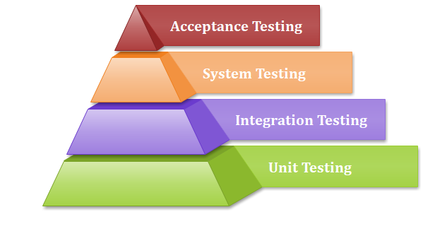

# Testing Levels

#### \#1. Unit Testing
Unit testing involves the testing of each unit or an individual component of the app. A unit is a single testable part of SW and tested during the development phase.
The purpose of unit testing is to test correctness of isolated code. A unit component is an individual function or code of app.Usually done by developers.

#### \#2. Integration Testing
Integration testing is the phase in SW testing in which individual SW modules are combined and tested as a group. The purpose of integrated testing is to detect any inconsistencies between the units that are integrated together. Integration testing is conducted to evaluate the compliance of a system or component with specified functional requirements.
*Approaches:*
- Big-bang - most of developed modules are coupled together to form a complete SW system or major part of it and then used for integration testing. This method is very effective for saving time in the integration testing process. However, if the TCs and their results are not recorded properly, the entire integration process will be more complicated and may prevent the testing team from achieving the goal of integration testing.
- Bottom-up - all the bottom or low-level modules, procedures or functions are integrated and then tested. After the integration testing of lower level integrated modules, the next level of modules will be formed and can be used for integration testng. This approach is helpful only when all or most of the modules of the same development level are ready. This method also helps to determine the levels of SW developed and makes it easier to report testing progress in the form of a percentage.
- Top-down - the top integrated modulesa are tested first. The branch of the module is tested step by step until the end of related module. Low-level modules are replaced with mocks that simulate similar functionality.
- Sandwich testing combines top-down with bottom-up. One limitation to this sort of testing is that any conditions not stated in specification tests, outside of the confirmation of the execution of design items, will generally not be tested.

#### \#3. System Testing
System testing is testing conducted on a complete integrated system to evaluate the system's compliance with its specified requirements.
Sytem testing takes, as its input, all of the integrated components that have passed integration testing. System testing seeks to detect defects both within the "inter-assemblages" and also withing the system as a whole. The actual result is the behavior produced or observed when a component or system is tested. 
System testing is performed on the entire system in the context of either functional requirement specifications (FRS) or system requirement specification (SRS), or both. System testing tests not only the design, but also the behaviour and even the believed expectations of the customer. It is also intended to test up to and beyond the bounds defined in the SW or HW requirements specification(s).

#### \#4. User Acceptance Testing
User Acceptance Testing (UAT) is a type of testing performed by the end user or the client to verify/accept the software system before moving the software application to the production environment. UAT is done in the final phase of testing after functional, integration and system testing is done.