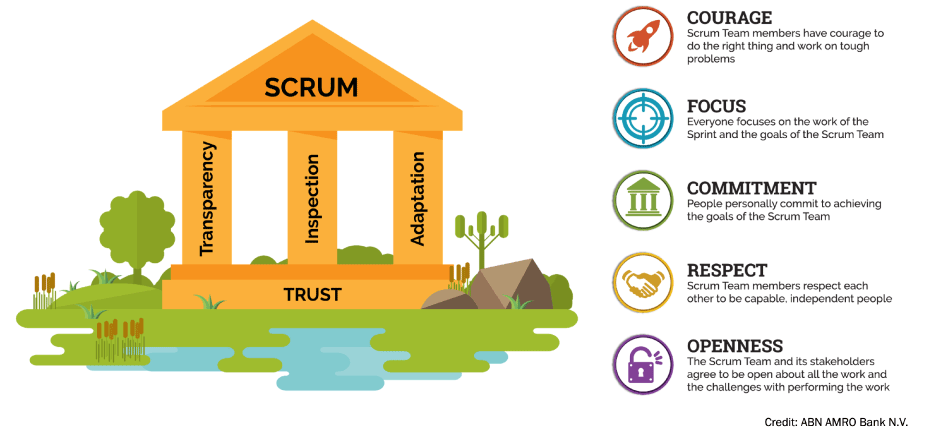

https://www.atlassian.com/agile/scrum
https://www.scrum.org/resources/what-is-scrum

# What is Scrum

Scrum is an agile project management framework that helps teams structure and manage their work through a set of values, principles, and practicies. Scrum encourages teams to learn through experiences, self-organize while working on a problem, and reflect on their wins and losses to continously improve.

Scrum is an empirical process, where decisions are based on observation, experience, and experimentation. Scrum has three pillars: **transparency, inspection and adaptation**. One critical Scrum Team characteristic that binds all of the elements together is **Trust**. If Trust is not present on a Scrum Team, there will likely be tension and bottlenecks in the way of getting work done.

The Scrum Values of **Courage, Focus, Commitment, Respect, and Openness** are all important elements that Scrum Team members must consider when working together. The Scrum Values are particularly important in environments where experimentation is core to making progress.

## Scrum Team

### Scrum Master
The person on the Scrum Team who uses their knowledge of Scrum to help the team and organization to be as effective as they can be; they do so by taking approaches like coaching, teaching, facilitating, and mentoring.

The scrum master focuses on:
- Transparency. To effectively inspect and adapt it is important that the right people can see what is going on. The scrum master is tasked with ensuring that the scrum team works in a transparent way. Examples include creating story maps and updating Confluence pages with retrospective ideas.
- Empiricism. A fundamental for scrum the idea that the best way of planning is to do work and learn from it. The empirical process is not easy and requires the scrum master to coach the scrum team on breaking down work, describing clear outcomes, and reviewing those outcomes.
- Self-organization. Telling a development team they can self-organize does mean that the team will self-organize. The scurm master will encourage team members to step outside their comfort zone and try different things.
- Values. Scrum defines 5 values of courage, focus, commitment, respect, and openness not because they are nice to have, but because they create an environment of physiological safety and trust. Following the values is the responsibility of everyone in the scrum team, but the scrum master takes an active role in encouraging and reminding everyone of the importance of those values.

### Product Owner
The person on the Scrum Team who makes sure that the team is creating the most valuable product the can create.

Product owner responsibilities:
- Managing the scrum backlog. This doesn't mean that they are the only one putting in new product backlog items into the backlog. But ultimately they are responsible for the backlog that the developers pull to deliver from. That means the product owner should know about everything that is in the backlog and other people that add items to the product backlog should ensure that they communicate with the product owern.
- Release management. It is important for the product owner to know when things can and should be released.
- Stakeholder management. Any product will have many stakeholders involved ranging from users, customers, governance and organizational leadership. The product owner will have to work with all these people to effectively ensure that the development team is delivering value.

### Developers
The people on the Scrum Team who work together to create the product. The 'developer' role in scrum means a team member who has the right skills, as part of the team to do the work.

The development team should be able to self-organize so they can make decisions to get work done.

The development team's responsibilities:
- Delivering the work through the sprint.
- To ensure transparency during the sprint they meet daily at the daily scrum. The Scrum master might facilitate the daily scrum, but ultimately it is the resposibility of the development team to run this meeting. It is their meeting to help them, as a group, to inspect and adapt the work they are doing and work in a more effective way.

## Scrum Events

### Sprint
Short cycles of one month or less, during which the work is done; the Sprint contains all of the other Scrum events; a new Sprint starts immediately after the conclusion of the previous Sprint.

### Sprint Planning
An event dedicated to planning out the work that will take place during the Sprint. At the end of the planning meeting, every scrum member needs to be clear on what can be delivered in the sprint and how the increment can be delivered.

- **Attendees**: Development team, Scrum master, and Product owner.

- **When**: At the beginning of a sprint.

- **Duration**: Usually arount one hour per week of iteration. e.g. a two-week sprint kicks off with a two-hour planning meeting.

- **Purpose**: Coming into the scrum meeting, the Product owner will have a prioritized product backlog. They discuss each item wiht the development team, and the group collectively estimates the effort involved. The development team will then make a sprint forecast outlining how much work the team can complete from the product backlog. That body of work then becomes the sprint backlog.

### Daily Scrum
An event held every day where the Developers inspect the progress toward the Sprint Goal, uncover anything that may be getting in their way and adapt accordingly.

- **Attendees**: Development team, Scrum master, Product owner.

- **When**: Once per day, typically in the morning.

- **Duration**: No more than 15 minutes.

- **Purpose**: A daily stand-up is designed to quickly inform everyone of what's going on across the team. It's not a detailed status meeting. The tone should be light and fun, but informative. Have each team member answer the following questions:
    - What did I complete yesterday?
    - What will I work on today?
    - Am I blocked by anything?

### Sprint Review
An event held at the end of the Sprint where the Scrum Team and key stakeholders review what was accomplished in the Sprint and what has changed in their environment; next, attendees collaborate on what to do next.

- **Attendees**: Development team, Scrum master, Prodcut owner.

- **When**: At the end of a sprint.

- **Duration**: Typically 45 minutes per week of iteration - e.g. a 90-minutes retrospective after a two-week sprint.

- **Purpose**: A sprint review is a time to showcase the work of the team. They can be in a casual format like "demo Fridays", or in a more formal scrum meeting structure. This is the time for the team to celebrate their accomplishments, demonstrate work finished within the iteration, and get immediate feedback from project stackeholders. Work should be fully demostrable and meet the team's quality bar to be considered complete and ready to showcase in the review.

### Sprint Retrospective
The Scrum Team gets together during this event to talk about how the last Sprint went and identify the most helpful changes to improve their effectiveness.

- **Attendees**: Development team, Scrum master, Prodcut owner.

- **When**: At the end of a sprint.

- **Duration**: Typically 45 minutes per week of iteration - e.g. a 90-minutes retrospective after a two-week sprint.

- **Purpose**: Retrospective helps the team understand what worked well and what didn't. Retrospectives aren't just a time for complaints without action. Use retrospectives to find out what's working so the team can continue to focus on those areas. Also, find out what's not working and use the time to find creative solutions and develop an action plan. Continuous improvement is what sustains and drives development within an agile team, and retrospective are a key part of that.

## Sprint Artifacts

- **Product Backlog** - an evolving, ordered list of what is needed to improve the product; it is the single source of work undertaken by the Scrum Team. Commitment: ***Product Goal*** - the target the team plans against.

- **Spring Backlog** - a highly visible list of work that is the Developer's plan for the Sprint, which may evolve as they learn. Commitment: ***Sprint Goal*** - the single objective of the Sprint.

- **Increments** - small pieces of work that serve as concrete stepping stones toward the Product Goal. You can deliver as often as needed during the Sprint and are not limited to only one release per Sprint. Commitment: ***Definition of Done*** - the description of what it takes for an Increment to be considered complete.