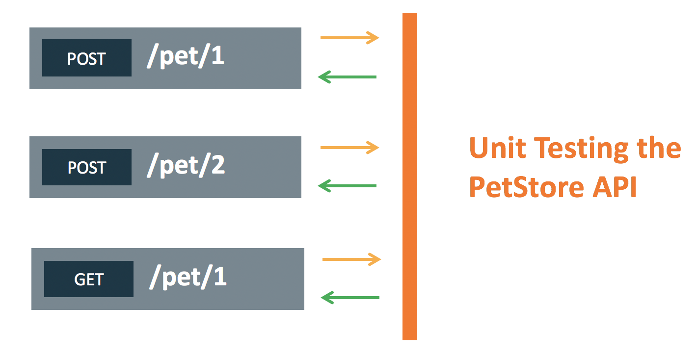
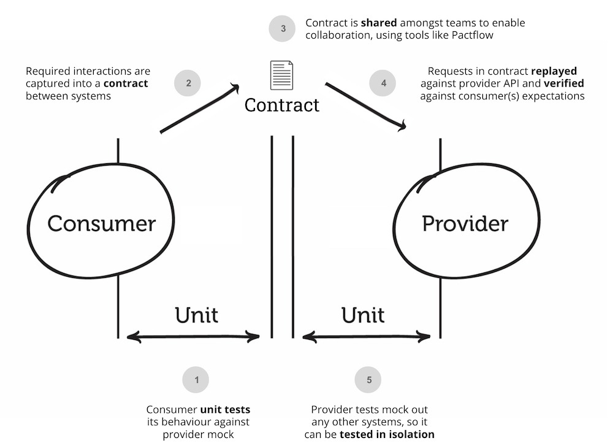
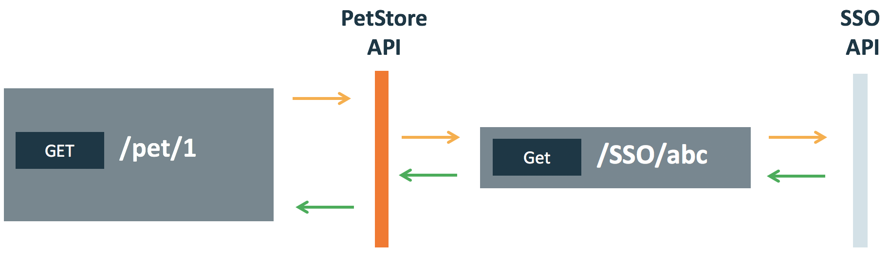

https://smartbear.com/solutions/api-testing/

# What is API Testing?

While there are many aspects of API testing, it generally consists of making requests to a single or sometimes multiple API endpoints and validating the response - whether for communication, performance, security, functional correctness, or just a status check. While UI testing may focus on validating the look and feel of a web interface or that a particular payment button work - API testing puts much more emphasis on the testing of business logic, data responses and security, and performance bottlenecks.

### The Benefits of API Testing

##### Earlier Validation
With API testing, once the logic is designed, tests can be built to validate the correctness in responses and data. We don't have to wait for vaious teams to finish their work or full applications to be developed - test cases are isolated and ready to build immediately.

##### Easier Test Maintenance
UIs are constantly changing and moving around based on how they are accessed - browsers, devices, screen orientation, etc. This creates a nightmare scenario where tests are incessantly rewritten to keep up with the actual code in production. API changes are much more controlled and infrequent - oftentimes API definitions files, like OpenAPI Spec, can help make refactoring tests into more of a minimal effort.

##### Faster Time to Resolution
When API tests fail, we know exactly where our system broke and where the defect can be found. This helps reduce time triaging bugs between builds, integrations, and even different team members. The small, isolated footpring of an API test is perfect for faster MTTR stats, a valuable KPI for DevOps teams.

##### Speed and Coverage
300 UI tests may take 30 hours to run. 300 API tests could be run in 3 minutes. That means you'll find more bugs in less time, while aslo being about to fix them immediately.

### The Types of API Testing

##### Unit Testing
While the testing world can be filled with misnomers, the easiest way to think about a "unit test" adn APIs is testing a single endpoint, with a single request, looking for a single response or set of responses. Many times, this types of testing can be done manually via the command line and something like a URL command or with lightweight tools like SaopUI.

##### Contract Testing
Contract teting is a technique which validates that two separate systems (such as two microservices) are able to communicate. The interactions exchanged between each service are captured and stored in a contract which is used to validate that both systems adhere to a common agreement.

##### Integration Testing
Integration testing is the most often used form of API testing, as APIs are at the center of most integrations between internal or third-party services.

##### End-to-End Testing
End-to-End testing can help us validate the flow of data and information between a few different API connections.

##### Performance Testing
API Performance Testing is any type of test that evaluate how well APIs perform under a given set of conditions.
https://smartbear.com/blog/api-performance-testing-for-success/
Performance testing is about creating product level load simulations within an application or system that is as near as possible to being a finished product to deploy, or an existing application that's already being used by customers.
Performance testing is about understanding the end user experience under load and ensuring your application can meet its SLAs.
***Types of Performance Testing:***
- **Load Tests**
The term Load Testing refers to a standard version of the performance test. You specify the number of VUs (virtual users), the test script and the time to run the test and all VUs hit your API continuously during the specified time while the teting tool records the performance. Then you can compare the performance metrics against the service-level agreement (SLA).
- **Stress Tests**
Stress testing is the simulation of heavy load on the server to find the maximum number of user the server can handle. This number is also called a crash point. The crash point does not necessary mean that the server crashes or hangs. It can mean that errors start happening or that the server performance or response time is below the level that your service-level agreement (SLA) defines.
- **Soak Tests**
A soak test is a load test that runs with a high but non-critical number of VUs for a long time, from several hours to multiple days. The idea behid Soak Testing is that sometimes a system seems to perform as expected under a particular load and then, suddenly, it stops working without any changes in traffic. Ideally, at the end of a test run, the server performance should be the same as it was at the beginning of the test. The decrease in performance can indicate that the server code has some issues.
- **Peak Tests**
Peak testing checks how your server works during the busiest periods. Peak testing is like soak testing, but with a much heavier load and shorter duration. These test cases can be helpful to test the scalability of your API, especially if you run it on severless or auto-scaling infrastructure.
- **Spike Tests**
Spike testing helps you check how the tested server responds to a sudden spike in the number of users. The server should be able to stabilize and return to normal functioning after the spike passes.