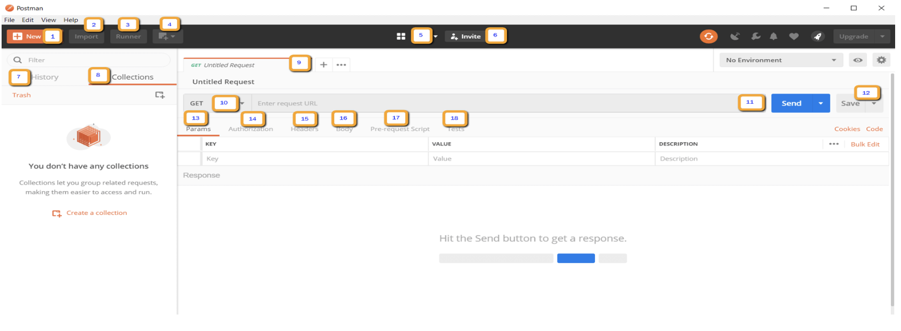
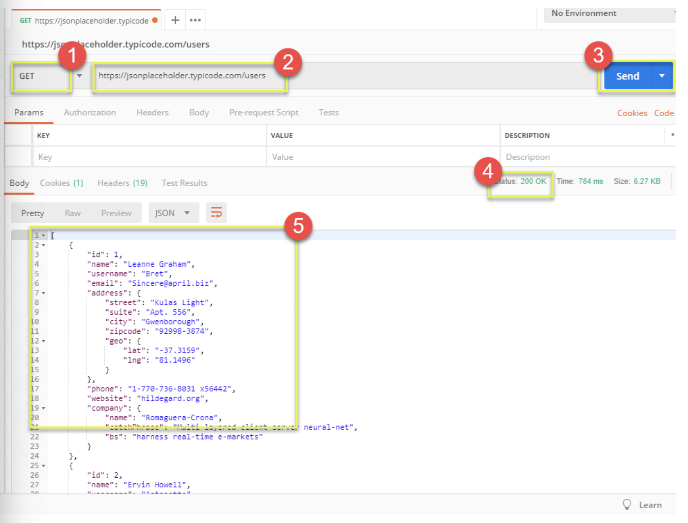
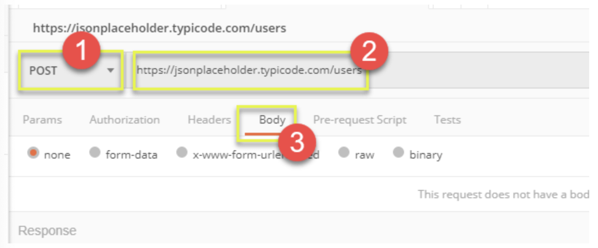
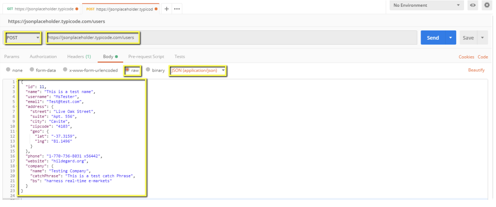
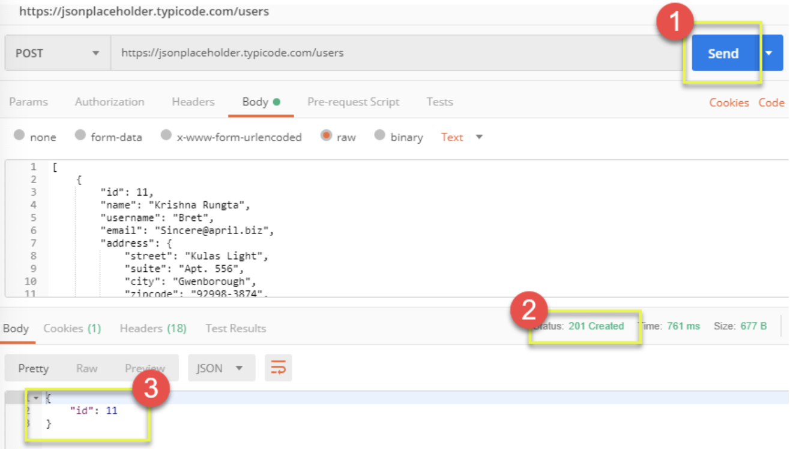
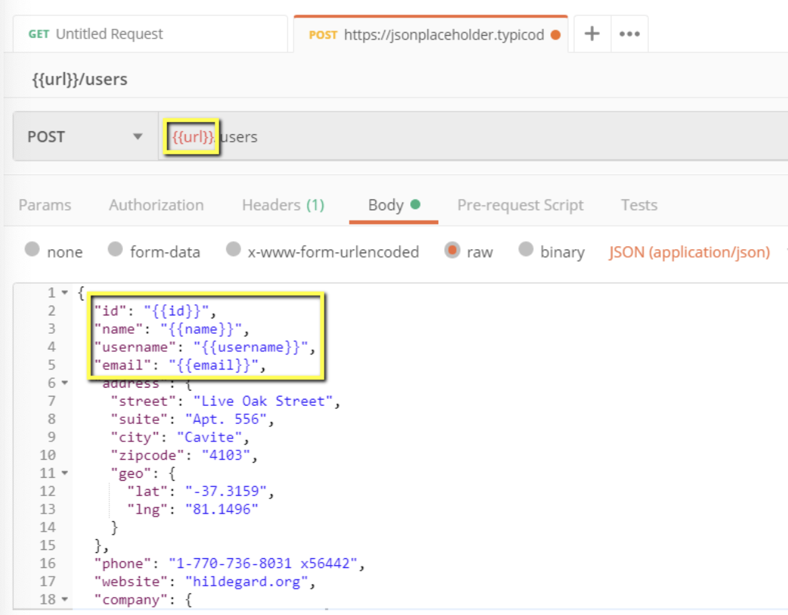
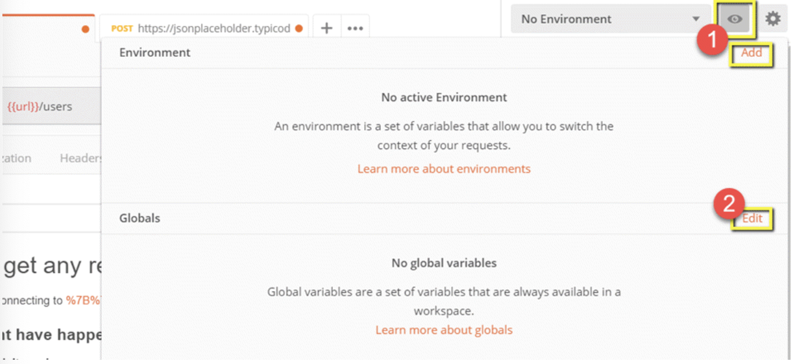
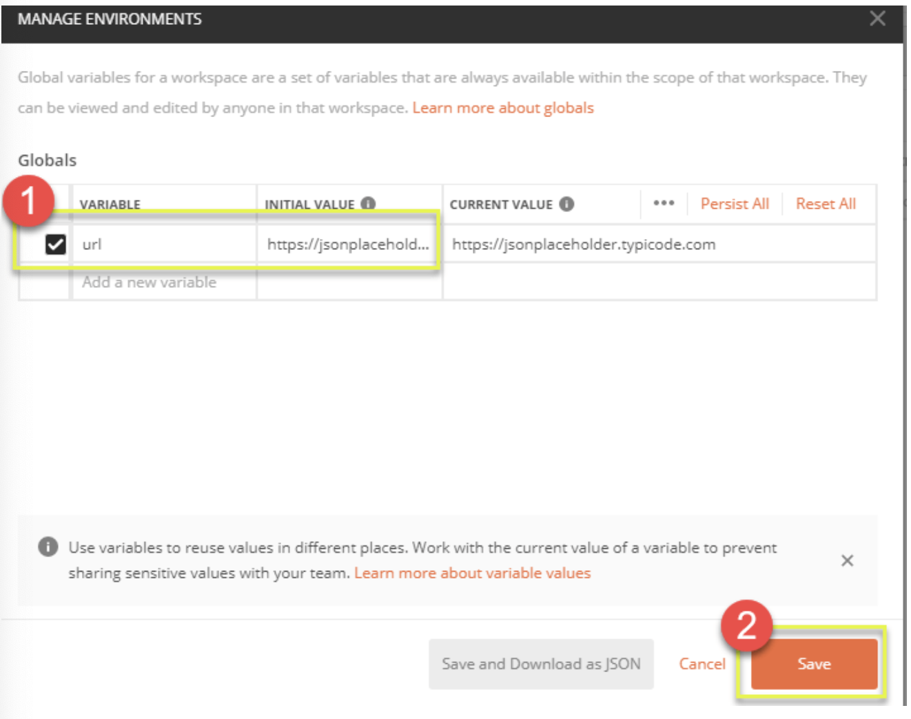

https://www.guru99.com/postman-tutorial.html

# What is Postman?
Postman is a scalable API testing tool that quickly integrates into CI/CD pipelines. It started in 2012 as a side project by Abhinav Asthana to simplify API workflow in testing and development.

##### Why Use Postman
1. **Accessibility** - to use Postman tool, one would just need to lon-in to their own accounts making it easy to access files anytime, anywhere as long as a Postman application is installed on the computer.
2. **Use of Collections** - Postman lets users create collections for their Postman API calls. Each collection can create subfolders and multiple requests. This helps in organizing your test suites.
3. **Collaboration** - Collections and environments can be imported or exported making it easy to share files. A direct link can also be used to share collections.
4. **Creating Environments** - Having multiple environments aids in less repetition of tests as one can use the same collection but for a different environment. This is where parameterization will take place.
5. **Creation of Tests** - Test checkpoints such as verifying for successful HTTP response status can be added to each Postman API calls which help ensure test coverage.
6. **Automation Testing** - Through the use of the Coolection Runner or Newman, tests can be run in multiple iterations saving time for repetitive tests.
7. **Debugging** - Postman console helps to check what data has been retrieved making it easy to debug tests.
8. **Continuous Integration** - With its ability ot support continuous integration, development practives are maintained.

### How to use Postman to execute APIs

1. New - This is where you will create a new request, collection or environment.
2. Import - this is used to import a collection or environment. There are options such as import file, folder, link or paste raw text.
3. Runner - automation tests can be executed through the Collection Runner. This will be discussed further in the next lesson.
4. Open New - open a new tab, Postman window or Runner Window by clicking this button.
5. My Workspace - you can create a new workspace individually or as a team.
6. Invite - collaborate on a workspace by inviting team members.
7. History - past requests that you have sent will be displayed in History. This makes it easy to track actions that you have done.
8. Collections - organize your test suite by creating collections. Each collection may have subfolders and multiple requests. A request or folder can also be duplicated as well.
9. Request tab - this displays the title of the request you are working on.
10. HTTP Request - clicking this would display a dropdown list of different requests such as GET, POST, COPY, DELETE, etc. In Postman API testing, the most commonly used requests are GET and POST.
11. Request URL - also known as an endpoint, this is where you will identify the link to where the API will communicate with.
12. Save - if there are changes to a request, clicking save is a must so that new changes will not be lost or overwritten.
13. Params - this is where you will write parameters needed for a request such as key values.
14. Authorization - in order to access APIs, proper authorization is needed. It may be in the form of a username and password, bearer token, etc.
15. Headers - you can set headers such as content type JSON depending on the needs of the organization.
16. Body - this is where one can customize details in a request commonly used in POST request.
17. Pre-request Script - there are scripts that will be executed before the request. Usually, pre-request scripts for the setting environment are used to ensure that tests will be run in the correct environment.
18. Tests - there are scripts executed during the request. It is important to have tests as it sets up checkpoints to verify if response status is ok, retrieved data is as expected and other tests.

##### Working with GET Requests
1. Set your HTTP request to GET.
2. In the request URL field, input link.
3. Click Send.
4. You will see 200 OK Message.
5. There should be list of resources in the body which indicates that your test has run seccessfully.

##### Working with POST Requests
1. Set your HTTP request to POST.
2. Iput request url
3. Switch to the Body tab

In body, 
1. Click raw
2. Select JSON
3. Insert request body

Next,
1. Click Send.
2. Status: 201 Created should be displayed.
3. Posted data is showing up in the body.

### How to Parameterize Requests
Data Parameterization is one of the most useful features of Postman. Instead of creating the same requests with different data, you can use variables with parameters. These data can be from a data file or an environment variable. Parameterization helps to avoid repetition of the same tests and iterations can be used for automation testing.
Parameters are created through the use of double curly brackets: {{sample}}. 

Parameterized GET request:
1. Set your HTTP request to GET
2. Input link (e.g. https://jsonplaceholder.typicode.com/users). Replace the first part of the link with a parameter such as {{url}} (request url should now be {{url}}/users).

To use the parameter you need to set the environment.
1. Click the eye icon.
2. Click edit to set the variable to a global environment which can be used in all collections.

In variable:
1. Set the name to the url (e.g. https://jsonplaceholder.typicode.com)
2. Click Save.

### How to Create Postman Tests
Postman Tests are JavaScript codes added to requests that help you verify results such as successful or failed status, comparison of expected results, etc. It usually starts with pm.test. It can be compared to asserts, verify commands available in other tools.
Let's do some basic API testing using Postman for our parameterize requests:
