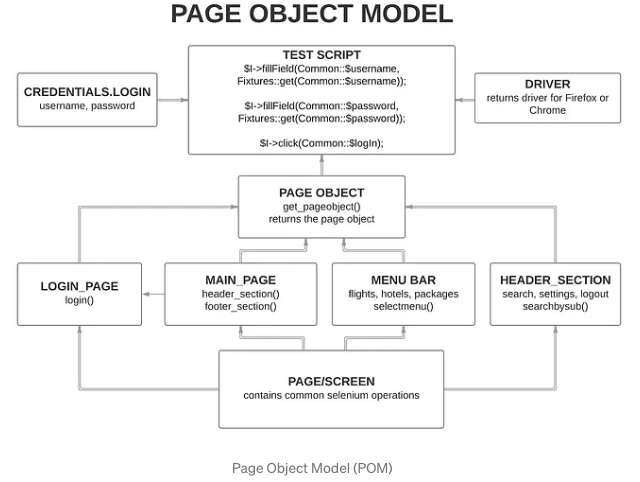

https://medium.com/tech-tajawal/page-object-model-pom-design-pattern-f9588630800b


# Page Object Model (POM)




## What is POM?

**Page Object Model** is a design pattern which has become popular in test automation for enhancing test maintenance and reducing code duplication. A page object is an object-oriented class that serves as an interface to a page of your SUT.

The tests then use the methods of this page object class whenever they need to interact with the UI of the page, the benefit is that if the UI changes for the page, the tests themselves don't need to be changed, only the code within the page object needs to change.

Subsequently all changes to support that new UI are located in one place.


## Why we need POM?

Increasing automation test coverage can result in unmaintainable project structure, if locators are not magaged in right way. This can happen due to duplication of code or mainly due to duplicated usage of locators.

***For example***, in home page of web application we have menu bar which leads to different modules with different features. Many automation TCs would be clicking through these menu buttons to execute specific tests. Imagine that the UI is changed/revamped and menu buttons are relocated to different position in home page, this will result automation tests to fail. Automated TCs will fail as scripts will not be able to find particular element-locators to perform action. 
Now, QA Engineer need to walk through whole code to update locators where necessary. Updating element-locators in duplicated code will consume a lot of time to only adjust locators, while this time can be consumed to increase test coverage. We can save this time by using **POM** in our test automation framework.


## Advantages of POM:

1. According to POM, we should keep our tests and element locators separetely, this will keep code clean and easy to understand and maintain.

2. The Page Object approach makes test automation framework programmer friendly, more durable and comprehensive.

3. Page Object Repository is Independent of Automation Tests. Keeping separate repository for page objects helps us to use this repository for different purposes with different frameworks like, we are able to integrate this repository with other tools like JUnit/NUnit/PhpUnit as well as with TestNG/Cucumber/etc.

4. Test Cases become short and optimized as we are able to reuse page object methods in the POM classes.

5. Any change in UI can easily be implemented, updated and maintained into the Page Object and Classes.


https://medium.com/@zackbunch/page-object-model-pom-in-selenium-python-73d0a805f2a8

## Implementing POM in Python

We will start off by creating a new Python project.

1. Create a folder called <mark>Pages</mark>
2. Create a folder called <mark>Resources</mark>
3. Create a folder called <mark>Tests</mark>
4. Create a folder called <mark>Drivers</mark>

Inside of the <mark>Page</mark> directory create two new files called <mark>yt_home_page.py</mark> and <mark>base_page.py</mark>

Under <mark>Resources</mark> directory create <mark>locators.py</mark> file.

Uner the <mark>Tests</mark> directory create <mark>base_test.py</mark> and <mark>test_home_page.py</mark> files.

The <mark>Drivers</mark> directory will hold the different browsers we want to test on such as Google Chrome, Firefox, Safari...


We need to be able to locate items on the webpages, so that we can interact with them. Selenium provides eight different built in element locating strategies:

- CLASS_NAME - a class name operator uses a class attribute to identify an object.
- CSS_SELECTOR - CSS is used to create style rules for webpages and can be used to identify any web element.
- ID - similar to class, we can also identify elements by using the 'id' attribute.
- LINK_TEXT - text used in hyperlinks can also locate element.
- NAME - name attribute can also identify an element.
- By.PARTIAL_LINK_TEXT - part of the text in the link can also identify an element.
- TAG - we can also use a tag to locate elements.
- XPATH - xpath is the language used to query the XML document. The same can uniquely identify the web element on any page.


Inside of the <mark>locators.py</mark> file lets add a class that will hold locators on the YouTube home page. For simplicity we want to be able to input text into the search field and click the search. So we will need two locators. 

```python
from selenium.webdriver.common.by import By

class HomePageLocators():
    yt_search_field = (By.ID, 'search')
    yt_search_button = (By.CLASS_NAME, 'style-scope ytd-searchbox')
```

Next, lets set up the <mark>base_page.py</mark> so that any page objects we choose to create can inherit from it. We want to practice DRY principles when writing our code.

```python
from selenium.webdriver.support import expected_conditions as EC
from selenium.webdriver.support.ui import WebDriverWait

class BasePage():
    """The BasePage class holds all common functionality across the website.
    Also provides a nice wrapper when dealing with selenium functions that may
    not be easy to understand.
    """

    def __init__(self, driver):
        """ This function is called every time a new object of the base class is created"""
        self.driver = driver
    
    def click(self, by_locator):
        """ Performs click on web element whose locator is passed to it"""
        WebDriverWait(self.driver, 10).until(EC.visibility_of_element_located(by_locator)).click()
    
    def enter_text(self, by_locator, text):
        """ Performs text entry of the passed in text, in a web element whose locator is passed to it"""
        return WebDriverWait(self.driver, 10).until(EC.visibility_of_element_located(by_locator)).send_keys(text)

    def get_title(self, title) -> str:
        """Returns the title of the page"""
        WebDriverWait(self.driver, 10).until(EC.title_is(title))
        return self.driver.title
```

### **Initializer**

All page objects need a reference to the WebDriver instanse. Typically, it is injected via the constructor. Here, it is passed into the ```__init__``` method as the ```driver``` parameter and then stored as the ```self.driver``` attribute. Dependency injection allows page objects to polymorphically use any type of WebDriver, whether it's ChromeDriver, IEDriver, or something else. it also lets the test framework control setup and cleanup.

All throughout any page we want to interact with we will be clicking elements. We create a method called click that takes in a locator and checks if it is visible on the webpage. If the element is visible and can be interacted with then it is clicked. Another method to enter text into the text boxes is used to interact with the search field or any other text box on different parts of the website. The final method we have  returns the title of the current webpage.

Inside of the <makr>yt_home_page.py</mark> we will get more specific on what can be done on the page. We begin by importing the ```BasePage``` and ```HomePageLocators```. We then create a class that inherits from the ```BasePage``` so we can reuse the functionality that we placed there. We call the get method in the constructor so that we load the YouTube homepage whenever the ```HomePage``` object is instantiated. Since we want to search a video on the ```HomePage```, we create a new method that enters text taken in as a parameter and clicks the search button.

```python
from Pages.base_page import BasePage
from Resources.locators import HomePageLocators

class HomePage(BasePage):
    def __init__(self, driver):
        super().__init__(driver)
        self.driver.get('http://www.youtube.com')
    
    def search_video(self, video_text):
        self.enter_text(HomePageLocators.yt_search_field, video_text)
        self.click(HomePageLocators.yt_search_button)
```

Finally we need to be able to run the code.

```python
import sys
import os
import unittest
from base_test import BaseTest

base_dir = os.path.dirname(__file__) or '.'
sys.path.append("..")

from Pages.yt_home_page import HomePage

class TestYTHomePage(BaseTest):
    def setUp(self):
        super().setUp()
        self.home_page = HomePage(self.driver)

    def test_search_video(self):
        self.home_page.search_video("Python Tutorial")
    
    

if __name__ == "__main__":
    unittest.main()
```


---

The Page Object Model can be used to make the test code more maintainable and minimize the amount of code duplication in your project/product. Though it helps make the code more modular, its overall impact can be more if used in conjunction with an automated cross browser testing platform