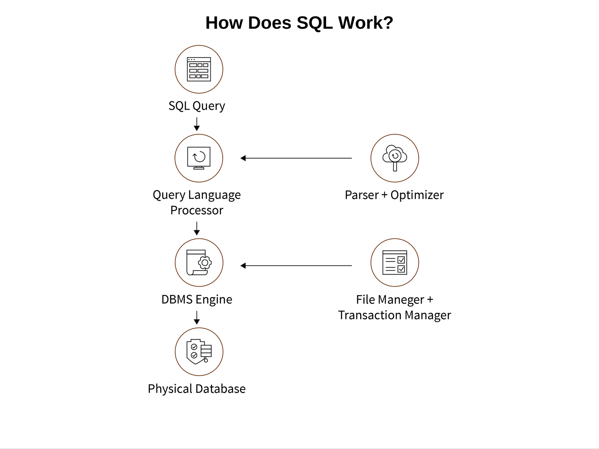

https://www.freecodecamp.org/news/dbms-and-sql-basics/

# DBMS and SQL
Database Management Systems and SQL are two of the most important and widely used tools on the internet today.

## What is DBMS?
Database Management System (DBMS) is used to store the data collected from various sources, and SQL to manipulate and access the particular data you want in an efficient way.

## What Does a DBMS Do?
A database is basically where we store data that are related to one-another - that is, inter-related data. This inter-related data is easy to work with.

A DBMS is software that manages the database. Some of the commonly used DBMS (software) are MS ACCESS, MySQL, Oracle, and others.

Using a DBMS goes hand in hand with SQL. This is because when you store data and want to access and alter it, you'll use SQL.

A database stores data in various forms like schemas, views, tables, reports, and more.

## Types of DBMS
First, you have ***Relational Databases (RDBMS)***. In these types of databases, data is stored in the format of tables by the software. In an RDBMS, each row consists of data from a particular entity only.

Some of RDBMS commonly used are MySQL, MSSQL, Oracle, and others.

***Non-Relational Databases*** - in this DBs, data is stored in the form of key and value pairs.

Some of the Non-Relational DBMSs commonly used are MongoDB, Amazon DynamoDB, Redis, and others.

## Components of a DBMS
- ***Software*** - this is the set of programs used to control and manage the overal database. This includes the DBMS software inself, the Operation System, the network software being used to share the data among users, and the application programs used to access data in the DBMS.
- ***Hardware*** - consists of a set of physical electronic devices such as computers, I/O devices, storage devices, etc., this provides the interface between computers and the real world systems.
- ***Data*** - DBMS exists to collect, store, process and access data, the most important component. The database contains both the actual or operational data and the metadata
- ***Procedures*** - these are the instructions and rules that assist on how to use the DBMS, and in designing and running the database, using documented procedures, to guide the users that operate and manage it.
- ***Database Access Language*** is used to access the data to and from the database, to enter new data, update existing data, or retrieve required data from databases. The user writes a set of appropriate commands in a database access language, submits these to the DBMS, which processes the data and generates and displays a set of results into a user readable form.
- ***Query Processor*** transforms the user queries into a series of low level instructions. This reads the online user's query and translates it into an efficient series of operations in a form capable of being sent to the run time data manager for execution.
- ***Run Time Database Manager*** - sometimes referred to as the database control system, this is the central software component of the DBMS that interfaces with user-submitted application programs and queries, and handles database access at run time. Its function is to convert operations in user's queries. It provides control to maintain the consistency, integrity and security of the data.
- ***Data Manager*** also called the cache manager, this is responsible for handling of data in the database, providing a recovery to the system that allows it to recover the data after a failure.
- ***Database Engine*** - the core service for storing, processing, and securing data, this provides controlled access and rapid transaction processing and address the requirements of the most demanding data consuming applications. It is often used to create relational DBs for online transaction processing or online analytical data processing.
- ***Data Disctionary*** - is a reserved space within a database used to store information about the database itself. A data dictionary is a set of read-only table and views, containing the different information about the data used in the enterprise to ensure that database representation of the data follow one standard as defined in the dictionary.
- ***Report Writer*** - also referred to as the report generator, it is a program that extracts information from one or more files and presents the information in a specified format. Most report writers allow the user to select records that meet certain conditions and to display selected fields in rows and columns, or also format the data into different charts.

## What is SQL?
SQL is a database language. SQL is used widely and almost all Relational Database Management Systems can recognize it.

SQL contains a set of commands that enable you to create a database. You can also use it to execute commands in your Relational Database Management System.

SQL has certain advantages which have helped it thrive from the 1970s until now. It is widely accepted by both people and platforms, in part because of the following features:
- SQL is fast
- SQL is a very high-level language
- SQL is a platform-independent language
- SQL is a standardized language
- SQL is a portable language

SQL performs a variety of tasks like creating, altering, maintaining and retrieving data, setting properties, and so on. All the tasks are done based on the commands you write, and these commands are grouped into various categories like DDL commands, DML commands, DCL commands, and so on.

## DDL commands
DDL stands for Data Definition Language. It includes the set of commands that you use to perform various tasks related to data definition: to specify the structure of the storage and methods through which you can access the database system.

You use DDL commands to perform the following functions:
- To create, drop, and alter.
- To grant and revoke various roles and privileges.
- Maintenance commands.

Example DDL commands include CREATE, ALTER, DROP, and TRUNCATE.

## DML commands
Data Manipulation Language. As the name suggests, it consists of commands which you use to manipulate the data.

You use these commands for the following actions:
- Deletion.
- Insertion.
- Retrieval.
- Modification.

Example DML commands are SELECT, INSERT, UPDATE, and DELETE.

## TCL commands
Transaction Control Language is used to control and manage transactions. Transaction - one complete unit of work that involves various steps.

Purposes:
- To create savepoints.
- To set properties of the transaction going on.
- To undo the changes to the database (permanent).
- To make changes in the database (permanent).

Example TCL commands include COMMIT, ROLLBACK, SAVE, and TRANSACTION.

## How DBMS and SQL Work Together
DBMS and SQL are interdependent and cooperate to make the data organized and accesible. Now, let's understand how SQL works in synchronization with a Database Management System.

SQL is the way you interact with the database management system. You use it to retrieve, insert, update, or delete data (CRUD operations), among other things.

When you execute a SQL command, the DBMS figures out the most efficient way to execute that command. The interpretation of the task to be performed is determinded by the SQL engine.

The classic query engine is used to handle all the non-SQL queries, but it will not handle any logical files.

The query processor interprets the queries of the user and translates them into a database-understandable format.

The parser is used for translation purposes (in query processing). It also checks the syntax of the query and looks for errors, if present.

The optimisation engine optimises the performance of the database wit the help of useful insights.

The DBMS engine is the underlying software component for performing CRUD operations on the database.

The file manager is used for managing the files in the database, one at a time.

And the transaction manager is used for managing the transactions to maintain concurrency while accessing data.