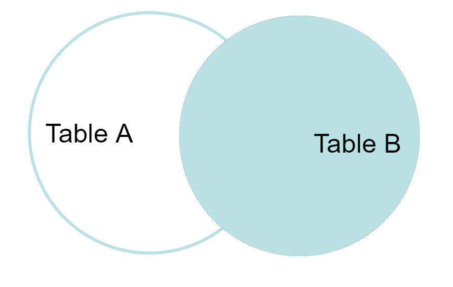

https://www.geeksforgeeks.org/sql-join-set-1-inner-left-right-and-full-joins/


# SQL JOIN (INNER, LEFT, RIGHT, and FULL JOIN)

SQL Join statement is used to combine data or rows from two or more tables based on a common field between them. Different types of JOINs are as follows:

- INNER JOIN
- LEFT JOIN
- RIGHT JOIN
- FULL JOIN


## INNER JOIN

The INNER JOIN keyword selects all rows from both the tables as long as the condition is satisfied. This keyword will create the result-set by combining all rows from both the tables where the condition satisfies i.e. value of the common field will be the same.

```sql
SELECT table1.column1,table1.column2,table2.column1,....
FROM table1 
INNER JOIN table2
ON table1.matching_column = table2.matching_column;
```


## LEFT JOIN

This JOIN returns all the rows of the table on the left side of the join and matches rows for the table on the right side of the join. For the rows for which there is no matching row on the right side, the resul-set will contain *null*. LEFT JOIN is also know as LEFT OUTER JOIN.

```sql
SELECT table1.column1,table1.column2,table2.column1,....
FROM table1 
LEFT JOIN table2
ON table1.matching_column = table2.matching_column;
```


## RIGHT JOIN

RIGHT JOIN is similar to LEFT JOIN. This join returns all the rows of the table on the right side of the join and matching rows for the table on the left side of the join. For the rows for which there is no matching row on the left side, the result-set will contain *null*. RIGHT JOIN is also known as RIGHT OUTER JOIN.

```sql
SELECT table1.column1,table1.column2,table2.column1,....
FROM table1 
RIGHT JOIN table2
ON table1.matching_column = table2.matching_column;
```




## FULL JOIN

FULL JOIN creates the result-set by combining results of both LEFT JOIN and RIGHT JOIN. The result-set will contain all the rows from both tables. For the rows for which there is no matching, the result-set will contain *null* values.

```sql
SELECT table1.column1,table1.column2,table2.column1,....
FROM table1 
FULL JOIN table2
ON table1.matching_column = table2.matching_column;
```

