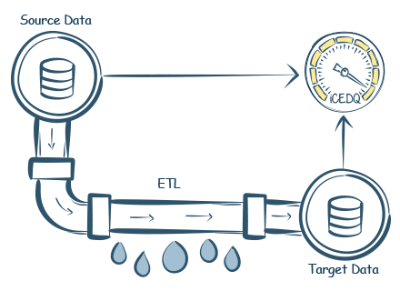
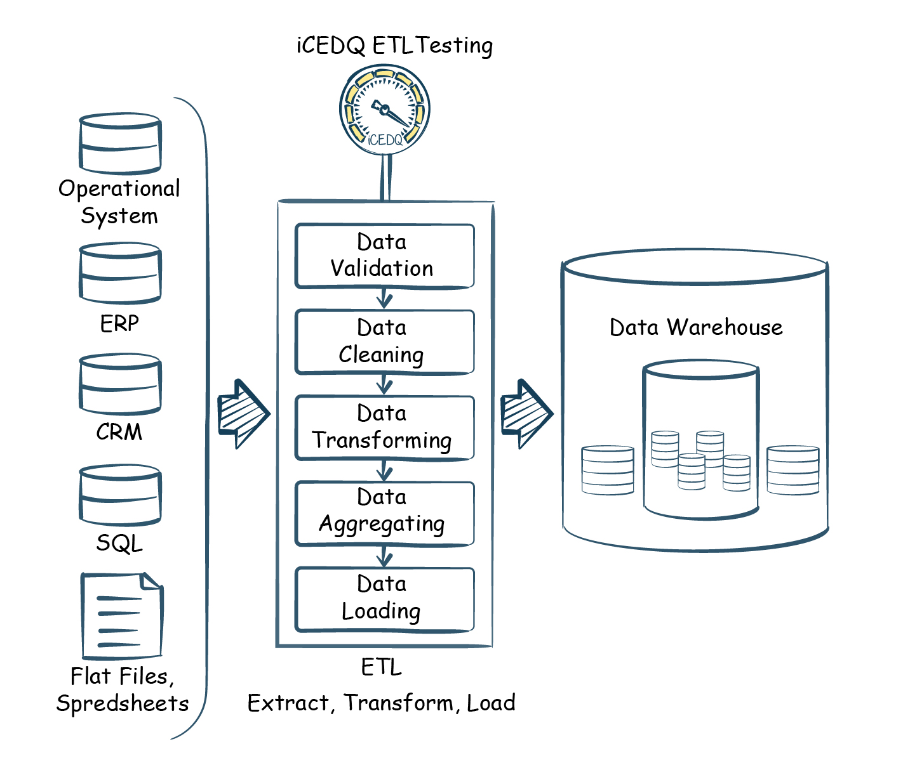
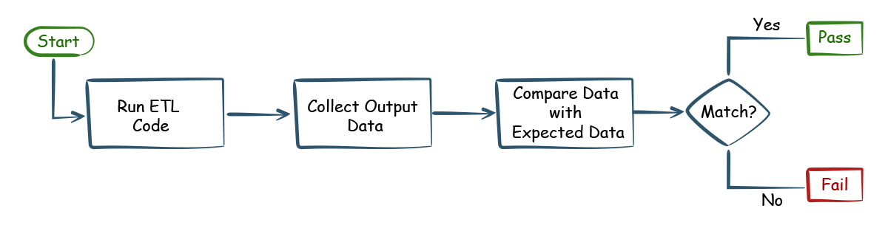
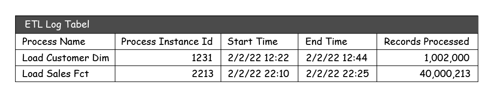

https://icedq.com/etl-testing

# ETL Testing Concepts

**ETL Testing** means that an ETL process is correctly ***extracting, transforming, and loadind*** data as per the specifications. ETL testing is done by validating and/or comparing the inpu and output data transformed by the ETL process.

ETL testing is used in data-centric projects having a huge amount of data or substantial number of data pipelines. It should not be confused with application testing which usually involves a small amount of transactional data.

ETL in testing means an extract, transform and load process that reads data from multiple source systems, transports it to a data transformation layer for further processing which includes cleaning, consolidating, integrating, and then loading into a target database or file.

---

## Why ETL testing is required?

1. Without ETL testing there is no way of knowing if the process is built to  the specifications and as per requirements.
2. Without ETL testing the code cannot be released or deployed in production.
3. ETL testing enables root cause analysis to identify data issues due to the source data or the ETL process.
4. It is very expensive and difficult to fix data issues in production. ETL testing ensures that the data issues are caught early in the development lifecycle.

ETL  testing is unique since,
- ETL processes are background processes and don't have user screens.
- ETL testing involves a large amount of data.
- ETL processes are like functions where testing requires execution of the ETL process and then the comparison of input and output data.
- The defects in the ETL processes cannot be detected by simply reviewing the ETL code.

---

## How to do ETL testing?

ETL testing process is summarized in the following three steps:

1. First, the ETL code is executed to generate the output data.
2. Then the output data is compared with the predetermined expected data.
3. Based on the comparison results, the quality of the ETL process is determined.

---

https://ua.talend.com/resources/etl-testing

## Eight stages of the ETL testing process

Effective ETL testing detects problems with the source data early on - before it is loaded to the data repository - as well as incosistencies or ambiguities in business rules intended to guide data transformation and itegration. The process can be broken down into eight stages.

1. **Identify business requirements** - Design the data model, define business flow, and assess reporting needs based on client expectations. It's important to start here so the scope of the project is clearly defined, documented, and understood fully by testers.

2. **Validate data sources** - Perform a data count check and verify that the table and column data type meets specifications of the data model. Make sure check keys are in place and remove duplicate data. If not done correctly, the aggregate report could be inaccurate or misleading.

3. **Design test cases** - Design ETL mapping scenarios, create SQL scripts, and define transformational rules. It is important to validate the mapping document as well, to ensure it contains all of the information.

4. **Extract data from source system** - Execute ETL tests per business requirement. Identify types of bugs or defects encountered during testing and make a report. It is important to detect and reproduce any defects, report, fix the bug, resolve, and close bug report - before continuing to step #5.

5. **Apply transformation logic** - Ensure data is transformed to match schema of target data warehouse. Check data threshold, alignment, and validate data flow. This ensures the data type matches the mapping document for each column and table.

6. **Load data into target warehouse** - Perform a record count check before and after data is moved from staging to the data warehouse. Confirm that invalid data is rejected and that the default values are accepted.

7. **Summary report** - Verify layout, options, filters and export functionality of summary report. This report lets decision-makers/stakeholders know details and results of the testing process and if any step was not completed i.e. "out of scope" and why.

8. **Test Closure** - File test closure.

---

## Types of ETL testing

### 1. ETL Source Data Validation Testing

This ETL testing checks input data for validity. Because if the input data itself is not valid you cannot expect the ETL process to transform the data correctly or for the process to even execute at all. The test involves checking for nulls, formats, reference values, duplicates, etc.

### 2. ETL Source to Target Data Reconciliation Testing

This test is mostly done to prove that there is no leakage while transporting or staging the data. Comparing the source (input) data and the target (output) data ensures that data completeness and consistency is not lost because of any issues in the ETL process. For example,
- Make sure the row count between the source and the target table is matching.
- Compare all the customer data in the source and the table to ensure that ETL loaded the data in the destination table as per the mapping rules.

### 3. ETL Data Transformation Testing

Data Transformation Testing ensures that every row has transformed successfully based on the mapping document. Testing Data Transformations involves reconciling the data between source and destination to verify that the ETL is transforming the data as expected. For example,
- Test the transformation of first name and last name source column into full name target column.
- Make sure that ETL is calculating the values correctly.

### 4. ETL Data Validation

An ETL process loads data into a destination data store. The ETL data validation verifies the data load by the ETL process. This is also called as ETL Load Testing as the data is validated only after the ETL loads the data. Data Validation Tests is used to validate a single data source, be it a database table, data extracts, dimension table, or a fact table. For example,
- Check if there are any nulls in the column.
- Validate the format of the email should be valid.
- There should be only one active record in a dimension table.
- Date in birth date column should be a valid date.
- Check if the Net amount cannot be less than zero.

### 5. ETL Referential Integrity Testing

The referential integrity testing ensures that the child table only have foreign key values that exists in the parent table. 

### 6. ETL Integration Testing

ETL integration testing is done to verify that the ETL process has integrated the data correctly. One of the key purposes of an ETL process is to integrate data from multiple data sources or multiple subject areas.

**Vertical Integration Testing:** in this case data is brought in from multiple data sources and integrated into a table. Example in this type of integration customer list from CRM system and accounting system is integrated in a single unified list. The integration must ensure that: 
- Attributes from multiple sources are mapped correctly to the destination.
- No duplicate records exist.

**Horizontal Integration Testing:** in this scenario data from multiple subject areas and sources are linked together to form meaningful relationship. A typical example is to link the salesperson data with sales data to calculate the commision. 

ETL integration testing involves creation of multiple ETL testing rules to verify if the data integration is done correctly. This is true because even though there might be one ETL process that integrates the data, it nevertheless contains multiple business ruless for data transformation. ETL testing must ensure that each of those integration rules are implemented correctly. This testing includes all the above types of testing.
- Ensure the data is going to the respective attributes.
- No duplicate entites exists and at the same time no unrelated entities are unified.
- Ensure the entities are linked correctly.

### 7. ETL Performance Testing

Even if the ETL process is coded correctly it is possible that, when executed it takes unreasonably more time to finish the job. ETL performance testing measures the time taken to finish processing a certain number of records vs. user expectations. The ETL performance metrics are usually measured in the number of rows processed per seconds.

To measure performance three metrics are needed: ETL processes start time, ETL process end time and number of records processed. The sources for the above metrics are:

- Special ETL log table which captures all the ETL process execution stats.
- Some of the metrics are derived from the target table with row level logging attributes such as record insert datetime, record update date time.

There is no universal standard for performance testing numbers, so it all depends on the expactations. However, some parameters must be taken into consideration that directly affects the ETL process performance numbers.

- Number of records inserted.
- Number of records updated or deleted.
- Logging is enabled or not in the target database.
- Row level locking setting in destination tables.
- Presence of indexes.
- The size of the processing machine.

### 8. ETL Functional Testing

The ETL functional tests are designed to ensure that the ETL is following the business rules defined by the users. While the test might look similar the thought behind the functional test is totally different. The example below will highlight the key differentiators.

There are processes that loads orders and shipments data from a source. The tester can compare the source orders with target orders and the source shipment with target shipment data; and the data is perfect match. While this is technically correct and the test is a success, it could still be failure from business rules or functional point of view. Here are few of the scenarios below:
- If there are more shipments then orders, that means shipment were done without orders. It is also possible that the shipment quantity and order quantity or the prices don't match between them.

These kinds of issues are tested by reconciling order and shipment and falls under the ETL functional testing.

### 9. ETL Unit Testing

The ETL testing done by the developer during development is called ETL unit testing. A unit ETL test is a test written by the programmer to verify that a relatively small piece of ETL code is doing what it is indended to do. They are narrow in scope. While testing activity is expected from QA team, some basic testing tasks are executed by the ETL developer during the development phase itself and much before the code is transitioned to QA team. This ensures basic data transformations are done correctly.

### 10. ETL Validation

ETL validation is technical test done as part of unit testing to ensure that the ETL is executed without crashing. It is usually done by the developer as part of the sanity checks as explained above.

## Scope of ETL Testing

The scope of ETL testing is restricted to ensuring the ETL process is correctly developed, and it is processing data as per the business requirements.

- Data Transformation and data loading is correct.
- ETL process does not create duplicate data.
- ETL process execution is done in proper order.
- ETL process has correct incremental logic for processing data.
- ETL emits proper exit codes on errors.
- ETL processes do not crash due to data exceptions.
- ETL process logs metadata about its process.

## Final tips and best practices

- **Do business test cases.** Don't just check whether your process works. Make sure that it's compliant with business requirements - each company has specific mapping instructions and data integration needs.

- **Thoroughly clean source data.** This step is unfortunately often done at execution time when the testing uncovers all the issues. We recommend finding errors from the start to save you from spending precious time dealing with processing bugs.

- **Test for speed.** BI operators need constant access to relevant data, so make sure the ETL process not only keeps data complete but also doesn't take much time.

- **Automate.** Some automation is better than no automation at all. If investigating in a tool is not an option, build some automation functionality yourself.

## Differences between the ETL and the Database testing

ETL and database testing involve data validation, but both are not same. ETL testing is usually performed on data in a data warehouse, whereas, database testing is performed on transactional systems. Data comes into the transactional database from different applications.

### Operations performed in ETL Testing

ETL testing involves the following operations:
- Validation of data movement from source to the target system.
- Data count verification is the source and target system.
- ETL testing verifies the transformation, extraction as per requirement and expectation.
- ETL testing verifies if table relations join and keys are preservers during the transformation.

### Operations performed in Database Testing

Database testing focuses on data accuracy, the correctness of data, and valid values. Database testing performs the following operations:
- Database testing focuses on verification of the column in a table that has valid data values.
- To verify whether the primary or foreign key is maintained, database testing is used.
- Database testing verifies if the data is missing in the column. Here, we check that there are no null values in columns which should have a valid value.
- We verify the accuracy of data in columns.