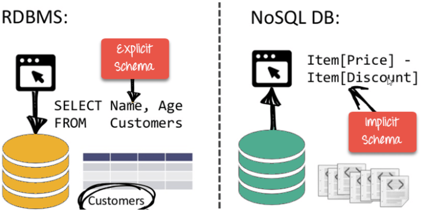
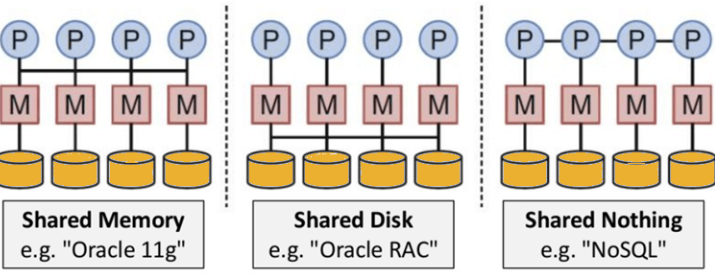
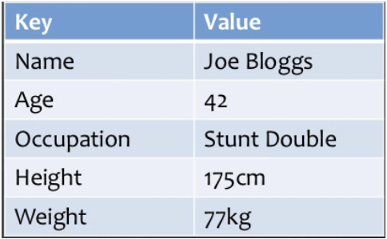
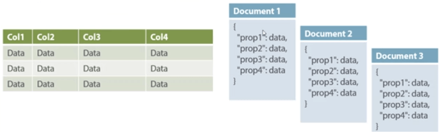
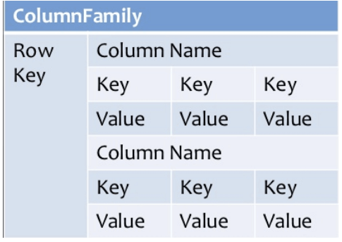
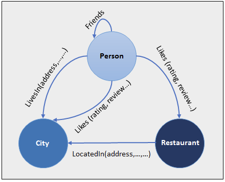

https://www.guru99.com/nosql-tutorial.html
https://www.ibm.com/topics/nosql-databases

# What is a NoSQL database?

NoSQL, aslo referred to as "not only SQL", "non-SQL", is an approach to database design that enables the storage and querying of data outside the traditional structures found in relational databases. While it can still store data found within relational DB management systems (RDBMS), it just store it differently compared to an RDBMS.

Instead of the typical tabular structure of a relational DB, NoSQL DBs, house data within one data structure, such as JSON document. Since this non-relational DB design does not require a schema, it offers rapid scalability to manage large and typically unstructured data sets.

NoSQL is also type of distributed DB, which means that information is copied and stored on various servers, which can be remote or local. This ensures availability and reliability of data. If some of the data goes offline, the rest of the DB can continue to run.

## Features of NoSQL

**1. Non-relational**

    - NoSQL DBs never follow the relational model
    - Never provide tables with flat fixed-column records
    - Work with self-contained aggregates of BLOBs
    - Doesn't require object-relational mapping and data normalization
    - No complex features like query languages, query planners, referential integrity joins, ACID (atomicity, consistency, isolation, durability)

**2. Schema-free**

    - NoSQL DBs are either schema-free or have relaxed schemas
    - Do not require any sort of definition of the schema of the data
    - Offers heterogeneous structures of data in the same domain

**3. Simple API**

    - Offers easy to use interfaces for storage and querying data provided
    - APIs allow low-level data manipulation & selection methods
    - Text-based protocols mostly used with HTTP REST with JSON
    - Mostly used no standard  based NoSQL query language
    - Web-enabled DBs running as internet-facing services

**4. Distributed**

    - Mutiple NoSQL DBs can be executed in a distributed fashion
    - Offers auto-scaling and fail-over capatibilities
    - Often ACID concept can be sacrificed for scalability and throughput
    - Mostly no synchronous replication between distributed nodes Asynchronous Multi-Master Replication, peer-to-peer, HDFS Replication
    - Only providing eventual consistency
    - Shared Nothing Architecture. This enables less coordination and higher distribution.

## Types of NoSQL DBs

NoSQL provides other options for organizing data in many ways. By offering diverse data structures, NoSQL can be applied to data analytics, managing big data, social netowrks, and mobile app development.

### Key-value store

This is typically consideted the simples form of NoSQL DBs. This schema-less data model is organized into a dictionary of key-value pairs, where each item has a key and a value. The key could be like something similar found in a SQL DB, like a shopping cart ID, while the value is an array of data, like each individual item in that user's shopping cart. It's commonly used for caching and storing user session information, such as shopping carts. However, it's not ideal when you need to pull multiple records at a time. Redis and Memcached are examples of an open-source key-value DBs.

### Document store

As suggested by the name, document DBs store data as documents. They can be helpful in managing semi-structured data, and data are typically stored in JSON, XML, or BSON formats. This keeps the data together when it is used in applications, reducing the amount of translation needed to use the data. Developers also gain more flexibility since data shemas do not need to match across documents (e.g. name vs. first_name). However, this can be problematic for complex transactions, leading to data corruption. Popular use cases of document databases include content management systems and user profiles. An example of a document-oriented DB is MongoDB.

### Wide-column store

These DBs store information in columns, enabling users to access only the specific columns they need without allocating additional memory on irrelevant data. This DB tries to solve for the shortcomings of key-value and document stores, but since it can be a more complex system to manage, it is not recommended for use for newer teams and projects.

Apache HBase and Apache Cassandra are examples of open-source, wide-column DBs. Apache HBase is built on top of Hadoop Distributed Files System that provides a way of storing sparse data sets, which is commonly used in many big data applications. 

Apache Cassandra, on the other hand, has been designed to manage large amounts of data accross multiple servers and clustering that spans multiple data centers. It's been used for a variety of use cases, such as social networking websites and real-time data analytics.

## Graph store

This type of DB typically houses data from a knowledge graph. Data elements are stored as nodes, edges and properties. Any object, place, or person can be a node. An edge defines the relationship between the nodes. For example, a node could be a client, like IBM, and an agency like, Ogilvy. An edge would be categorize the relationship as a customer relationship between IBM and Ogilvy.

Gpaph DBs are used for storing and managing a network of connections between elements within the graph. Neo4J, Infinite Graph, OrientDB, FlockDB are some popular graph-based databases.

## Advantages of NoSQL

- Can be used as Primary or Analytic Data Source
- Big data capability
- No single point of failure
- Easy replication
- No need for separate Caching Layer
- It provides fast structured, semi-structured, and unstructured data with equal effect
- Object-oriented programming which is easy to use and flexible
- NoSQL DBs don't need a dedicated high-performance server
- Support key developer languages and platforms
- Simple to implement than using RDBMS
- It can serve as the primary data source for online applications
- Handles big data which manages data velocity, variety, volume, and complexity
- Excels at distributed DB and multi-data center operations
- Offers a flexible schema design which can easily be altered without dowtime or service disruption

## Disadvantages of NoSQL

- No standardization rules
- Limited query capabilities
- RDBMS databases and tools are comparatively mature
- It does not offer any traditional database capabilities, like consistency when multiple transactions are performed simultaneously
- When the volume of data increases it is difficult to maintain unique values as keys become difficult
- Doesn't work as well with relational data
- The learning curve is stiff for new developers

## Summary

- NoSQL is a non-relational DMS, that doesn't require a fixed schema, avoids joins, and is easy to scale
- The concept of NoSQL DBs became popular after companies started to deal with huge volumes of data
- NoSQL DBs never follow the relational model it is either schema-free or has relaxed schemas
- Four types of NoSQL DBs are: key-value pair based, column-oriented, graph based, and document oriented
- NoSQL can handle structured, semi-structured, and unstructured data with equal effect
- NoSQL offer limited query capabilities